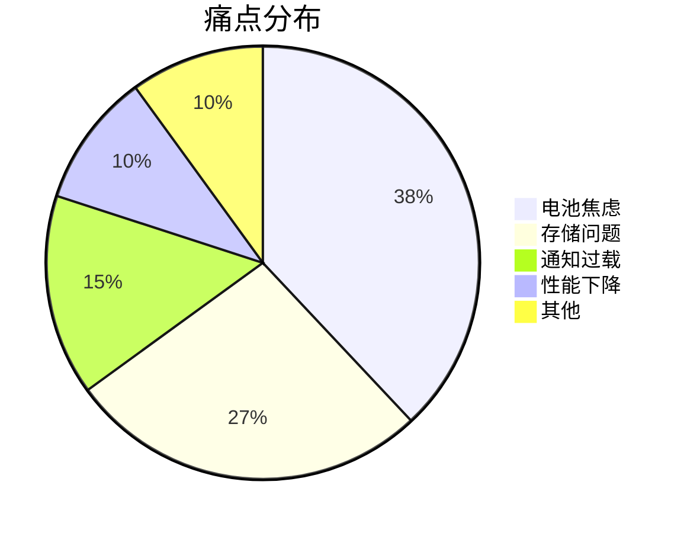

# 数据分析与可视化技能

## 概述

本技能提供商业研究中常用的数据分析方法,帮助从原始数据中提取可执行的洞察。

## 核心能力

1. **痛点聚类分析**: 将用户反馈归类识别核心痛点
2. **频率统计**: 量化痛点的普遍性
3. **趋势识别**: 发现时间序列中的模式
4. **市场规模计算**: TAM/SAM/SOM 估算
5. **数据可视化**: 生成图表和报告

## 工具要求

- **SQLite MCP**: 数据查询
- Python (可选): 高级分析和可视化

## 分析方法

### 1. 痛点聚类分析

**目标**: 从 100+ 条用户原话中识别 5-10 个核心痛点

**步骤**:
```
1. 数据准备
   - 从 SQLite 提取用户原话
   - 清洗和标准化文本

2. 初步标签
   - 阅读前 20 条,手动打标签
   - 建立初始分类体系

3. 批量分类
   - 使用关键词匹配
   - 相似内容归为一类

4. 频率统计
   - 统计每个类别的数量
   - 计算占比

5. 痛点评分
   - 频率 × 强度 × 付费意愿
```

**SQL 查询示例**:
```sql
-- 统计痛点类别频率
SELECT 
  category,
  COUNT(*) as count,
  AVG(upvotes) as avg_upvotes,
  COUNT(*) * 100.0 / (SELECT COUNT(*) FROM user_quotes) as percentage
FROM user_quotes
GROUP BY category
ORDER BY count DESC;

-- 提取高频痛点的样本
SELECT quote, source, upvotes
FROM user_quotes
WHERE category = 'battery_anxiety'
ORDER BY upvotes DESC
LIMIT 10;
```

**输出格式**:
```markdown
## 痛点聚类结果

| 痛点类别 | 提及次数 | 占比 | 平均 Upvotes | 严重程度 |
|---------|---------|------|-------------|---------|
| 电池焦虑 | 45 | 38% | 520 | ⭐⭐⭐⭐⭐ |
| 存储问题 | 32 | 27% | 380 | ⭐⭐⭐⭐ |
| 通知过载 | 18 | 15% | 210 | ⭐⭐⭐ |
```

### 2. 频率统计与分布分析

**目标**: 量化痛点的普遍性和分布

**关键指标**:
- **绝对频率**: 提及次数
- **相对频率**: 占比
- **加权频率**: 考虑 upvotes/likes
- **时间分布**: 痛点随时间的变化

**SQL 查询**:
```sql
-- 时间分布分析
SELECT 
  DATE(created_at) as date,
  category,
  COUNT(*) as daily_count
FROM user_quotes
WHERE created_at >= DATE('now', '-6 months')
GROUP BY DATE(created_at), category
ORDER BY date DESC;

-- 来源分布
SELECT 
  source,
  category,
  COUNT(*) as count
FROM user_quotes
GROUP BY source, category;
```

**可视化建议**:
- 柱状图: 痛点类别频率对比
- 折线图: 痛点随时间的趋势
- 饼图: 痛点占比分布
- 热力图: 不同来源的痛点分布

### 3. TAM/SAM/SOM 计算

**目标**: 估算市场规模

**公式**:
```
TAM (Total Addressable Market):
= 全球潜在用户数 × 年付费金额

SAM (Serviceable Available Market):
= TAM × 实际可服务比例

SOM (Serviceable Obtainable Market):
= SAM × 实际可获得比例
```

**示例计算**:
```markdown
### iOS 电池健康工具市场规模

**TAM 计算**:
- 全球 iPhone 用户: 10 亿
- 年付费金额: $30
- TAM = 10 亿 × $30 = $300 亿

**SAM 计算**:
- 关心电池健康的用户比例: 20%
- SAM = $300 亿 × 20% = $60 亿

**SOM 计算** (Year 1):
- 预计下载量: 50,000
- 转化率: 5%
- 付费用户: 2,500
- 年收入: 2,500 × $35 = $87,500
```

**数据来源**:
- 用户基数: Statista, Sensor Tower
- 付费意愿: Reddit 调查, 竞品定价
- 转化率: 行业 benchmark (2-5%)

### 4. 竞品数据分析

**目标**: 量化竞品格局

**关键指标**:
```markdown
| 竞品 | 估算下载量 | 估算收入 | 评分 | 评论数 | 市场份额 |
|------|-----------|---------|------|--------|---------|
| A    | 500K      | $50K/月 | 4.2  | 12K    | 35%     |
| B    | 300K      | $30K/月 | 3.8  | 8K     | 21%     |
| C    | 200K      | $20K/月 | 4.5  | 5K     | 14%     |
```

**SQL 查询**:
```sql
-- 竞品评分趋势
SELECT 
  competitor_name,
  date,
  rating,
  review_count
FROM competitor_tracking
ORDER BY date DESC;

-- 竞品功能覆盖率
SELECT 
  feature_name,
  SUM(CASE WHEN has_feature = 1 THEN 1 ELSE 0 END) as competitor_count,
  COUNT(*) as total_competitors,
  SUM(CASE WHEN has_feature = 1 THEN 1 ELSE 0 END) * 100.0 / COUNT(*) as coverage_rate
FROM competitor_features
GROUP BY feature_name
ORDER BY coverage_rate ASC;
```

### 5. 情感分析

**目标**: 量化用户情感倾向

**分类**:
- 正面 (Positive): 满意、喜欢、推荐
- 中性 (Neutral): 客观描述、建议
- 负面 (Negative): 抱怨、失望、愤怒

**简单规则**:
```
正面关键词: love, great, awesome, perfect, recommend
负面关键词: hate, terrible, awful, worst, disappointed
强度词: very, extremely, absolutely, completely
```

**SQL 查询**:
```sql
-- 情感分类统计
SELECT 
  sentiment,
  COUNT(*) as count,
  AVG(upvotes) as avg_upvotes
FROM (
  SELECT 
    *,
    CASE 
      WHEN quote LIKE '%love%' OR quote LIKE '%great%' THEN 'positive'
      WHEN quote LIKE '%hate%' OR quote LIKE '%terrible%' THEN 'negative'
      ELSE 'neutral'
    END as sentiment
  FROM user_quotes
)
GROUP BY sentiment;
```

### 6. 趋势识别

**目标**: 发现时间序列中的模式

**分析维度**:
- 上升趋势: 痛点越来越严重
- 下降趋势: 痛点正在被解决
- 季节性: 特定时间段的波动
- 突发事件: 某个版本更新导致的问题

**SQL 查询**:
```sql
-- 月度趋势
SELECT 
  strftime('%Y-%m', created_at) as month,
  category,
  COUNT(*) as count
FROM user_quotes
GROUP BY month, category
ORDER BY month DESC;

-- 增长率计算
WITH monthly_counts AS (
  SELECT 
    strftime('%Y-%m', created_at) as month,
    COUNT(*) as count
  FROM user_quotes
  GROUP BY month
)
SELECT 
  a.month,
  a.count as current_count,
  b.count as previous_count,
  (a.count - b.count) * 100.0 / b.count as growth_rate
FROM monthly_counts a
LEFT JOIN monthly_counts b ON 
  DATE(a.month || '-01', '-1 month') = DATE(b.month || '-01')
ORDER BY a.month DESC;
```

## 数据可视化

### 使用 Markdown 表格
简单直观,适合报告:
```markdown
| 维度 | 数值 | 趋势 |
|------|------|------|
| 用户原话 | 120 | ↑ |
| 痛点类别 | 8 | → |
| 平均 Upvotes | 450 | ↑ |
```

### 使用 ASCII 图表
轻量级可视化:
```
电池焦虑: ████████████████████ 45 (38%)
存储问题: ██████████████ 32 (27%)
通知过载: ████████ 18 (15%)
性能下降: ████ 12 (10%)
其他:     ████ 11 (10%)
```

### 使用 Mermaid 图表
复杂关系可视化:


## 分析报告模板

```markdown
# 数据分析报告: [主题]

## 数据概况
- 分析时间: YYYY-MM-DD
- 数据来源: [列出来源]
- 数据量: X 条记录
- 时间范围: YYYY-MM-DD 至 YYYY-MM-DD

## 痛点聚类
[痛点频率表格]

### Top 3 痛点详细分析

#### 1. [痛点名称]
- 提及次数: X
- 占比: XX%
- 严重程度: ⭐⭐⭐⭐⭐
- 典型用户原话:
  > "..."
  > "..."

## 市场规模估算
- TAM: $XXX
- SAM: $XXX
- SOM (Year 1): $XXX

## 竞品分析
[竞品对比表格]

## 趋势分析
[时间趋势图表]

### 关键发现
1. [发现 1]
2. [发现 2]
3. [发现 3]

## 建议
基于数据分析,建议:
1. [建议 1]
2. [建议 2]
3. [建议 3]
```

## 常用 SQL 查询库

### 基础统计
```sql
-- 总记录数
SELECT COUNT(*) FROM user_quotes;

-- 按类别统计
SELECT category, COUNT(*) 
FROM user_quotes 
GROUP BY category;

-- Top 10 高赞内容
SELECT quote, upvotes, source
FROM user_quotes
ORDER BY upvotes DESC
LIMIT 10;
```

### 高级分析
```sql
-- 交叉验证: 同一痛点在多个来源出现
SELECT category, COUNT(DISTINCT source) as source_count
FROM user_quotes
GROUP BY category
HAVING source_count >= 3;

-- 痛点严重程度评分
SELECT 
  category,
  COUNT(*) as frequency,
  AVG(upvotes) as avg_intensity,
  COUNT(*) * AVG(upvotes) as severity_score
FROM user_quotes
GROUP BY category
ORDER BY severity_score DESC;
```

## 最佳实践

1. **数据质量优先**: 宁可少而精,不要多而杂
2. **三角验证**: 重要结论需要多个数据源支撑
3. **保守估算**: 市场规模宁可低估,不要高估
4. **可视化辅助**: 图表比文字更直观
5. **记录假设**: 明确计算中的假设条件
6. **定期更新**: 数据会过时,需要定期刷新

## 输出清单

每次分析应产出:
- [ ] 痛点聚类表格
- [ ] 频率统计图表
- [ ] TAM/SAM/SOM 计算
- [ ] 竞品对比矩阵
- [ ] 趋势分析图表
- [ ] 完整的分析报告
